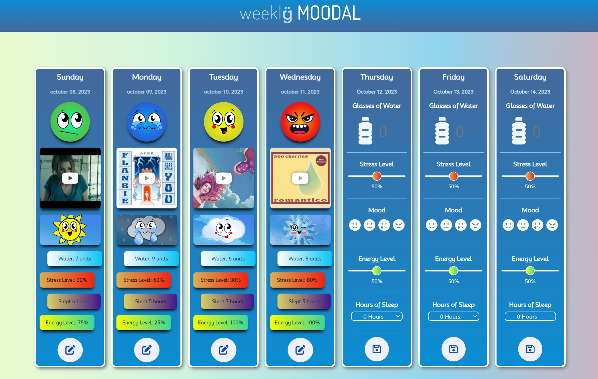
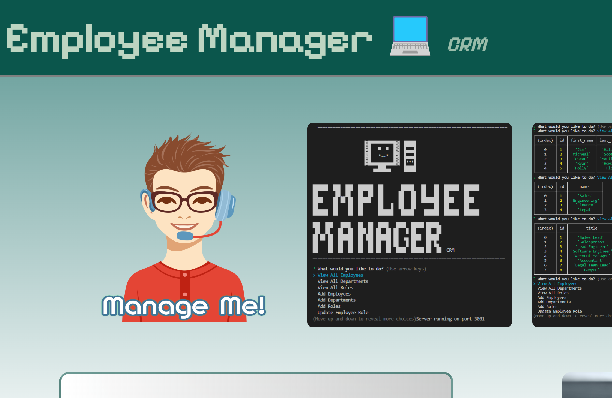

# **Ryan J. <span style="color:dodgerblue"> Fann </span>**

### <a href="#contact"> 👾 <span style="color:orange"> **_8BitGinger_** </span> </a>

```

let Ryan = "Your New Web Developer!"

const Success = [determination, hard work, and vision]

```


## 😎 About Me

> ### Web Development Professional
>
> with a strong background in
>
> <li>Management</li>
> <li>Customer Service</li>
> <li>Sales</li>
> <br>

<span style="color:green"> <br> **_Looking for the right opportunity to turn my creativity, ingenuity, and positive attitude into your business advantage._** </span>

#### Enrolled at UTSA Full Stack Web Development Program []()

---

## ⚡ Key Skills

[]()
[]()
[]()
[]()
[]()
[]()
[]()
[]()
[]()
[]()
[]()
[]()
[]()
[]()
[]()
[]()
[]()
[]()
[]()
[]()
[]()
[]()
[]()
[]()
[]()
[]()
[]()
[]()
[]()

---

[]()
[]()

## 🏫 Education

1. Full Stack Web Development at UTSA
2. Bachelors of Business Administration Corllins University
3. Diploma from Shallowater High School

## 📚 My Portfolio

[](https://8bitginger.github.io/studentPortfolio/)
[](https://8bitginger.github.io/resume/)

## 🔭 Project Screenshots

#### <span style="color:yellow"> **_Full projects can be viewed on Portfolio!_** </span>

### Weekly Moodal **_Mental Health Tracker_**



### JavaScript Quiz **_JavaScript Coding Quiz_**


### NoteTaker **_Express.js Backend_**


### Workforce Manager **_Back-End CRM_**



---

<a id="contact"></a>

## 📱 Contact Me

<p align="center">
  
</p>

[](mailto:ryan.fann@gmail.com)
[](https://github.com/8BitGinger)
[](https://facebook.com/ryanfann)
[](https://utsavirtfsfpt-gvi3942.slack.com/team/U05MCKH85D4)

[](https://github.com/8BitGinger)
