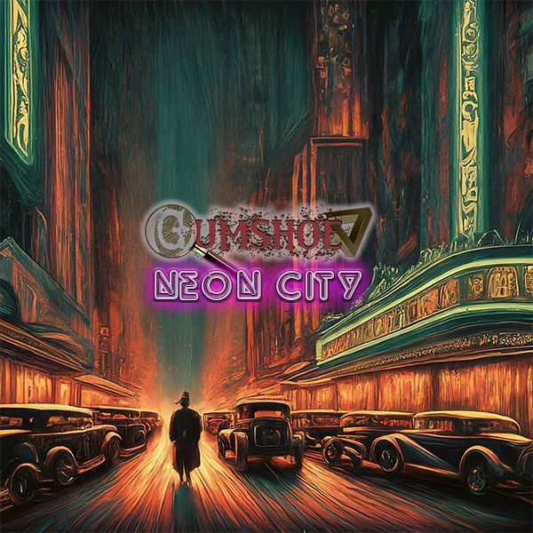
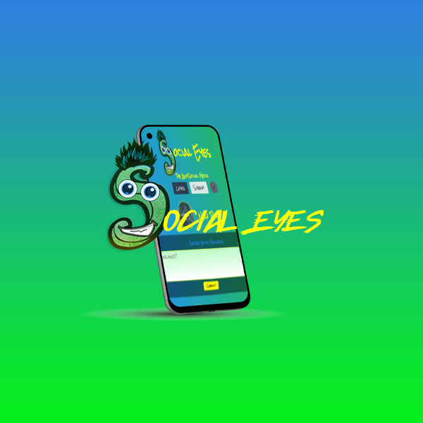
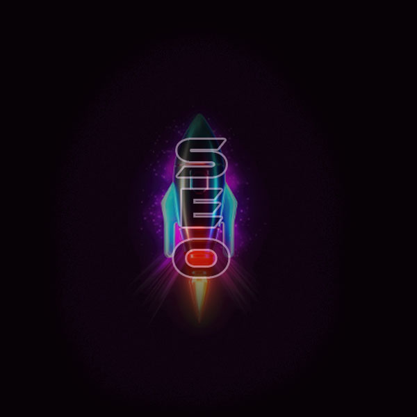
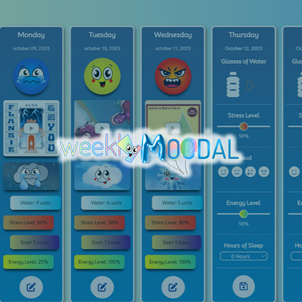
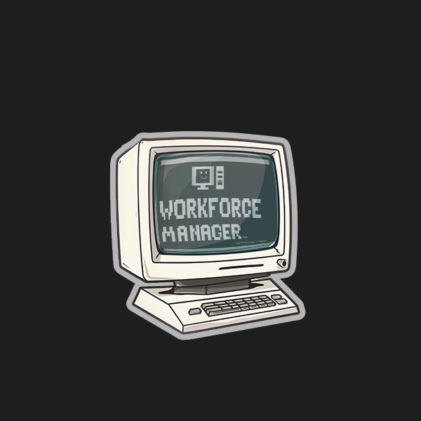

# **Ryan J. <span style="color:dodgerblue"> Fann </span>**

### <a href="#contact"> 👾 <span style="color:orange"> **_8BitGinger_** </span> </a>

```

let Ryan = "Your New Web Developer!"

const Success = [determination, hard work, and vision]

```

[](https://ryanfann.netlify.app/)

## 😎 About Me

> ### Web Development Professional
>
> with a strong background in
>
> <li>Management</li>
> <li>Customer Service</li>
> <li>Sales</li>
> <br>

<span style="color:green"> <br> **_Looking for the right opportunity to turn my creativity, ingenuity, and positive attitude into your business advantage._** </span>

#### Completed the UTSA Full Stack Web Development Program [](https://bootcamp.utsa.edu/coding/landing-b5a/?s=Google-Brand_Tier-1_&dki=Learn%20Coding%20and%20More%20Online&pkw=%2But%20%2Bsan%20%2Bantonio%20%2Bcoding&pcrid=464375785329&pmt=b&utm_source=google&utm_medium=cpc&utm_campaign=GGL%7CUT-SAN-ANTONIO%7CSEM%7CCODING%7C-%7COFL%7CTIER-1%7CALL%7CBRD%7CBMM%7CCore%7CGeneral&utm_term=%2But%20%2Bsan%20%2Bantonio%20%2Bcoding&s=google&k=%2But%20%2Bsan%20%2Bantonio%20%2Bcoding&utm_adgroupid=108681621083&utm_locationphysicalms=9028005&utm_matchtype=b&utm_network=g&utm_device=c&utm_content=464375785329&utm_placement=&gad_source=1&gclid=Cj0KCQjwwMqvBhCtARIsAIXsZpa7GHpSLYE-gr0cu5473O8gvKw7f1UQzreP2ZFJIjCDqbEQl_oglDQaAoAXEALw_wcB&gclsrc=aw.ds)

---

## ⚡ Key Skills

[]()
[]()
[]()
[]()
[]()
[]()
[]()
[]()
[]()
[]()
[]()
[]()
[]()
[]()
[]()
[]()
[]()
[]()
[]()
[]()
[]()
[]()
[]()
[]()
[]()
[]()
[]()
[]()
[]()
[]()
[]()
[]()
[]()
[]()
[]()
[]()
[]()
[]()
[]()
[]()
[]()
[]()
[]()
[]()
[]()
[]()
[]()
[]()
[]()
[]()
[]()

<!-- []()
[]()
[]() -->
<!-- []() -->
<!-- []()


-->

---

[]()
[]()

## 🏫 Education

1. Full Stack Web Development at UTSA
2. Bachelors of Business Administration Corllins University
3. Diploma from Shallowater High School

## 📚 My Portfolio

[](https://8bitginger.github.io/studentPortfolio/)
[](https://8bitginger.github.io/resume/)

## 🔭 Project Screenshots

#### <span style="color:yellow"> **_Full List of current projects can be viewed on Portfolio!_** </span>

### Gumshoe RPG **_Detective Noir RPG_**

[](https://gumshoe.vercel.app/)

<details closed>
<summary>Click Here to see more!</summary>
<br>

Click the image to view the live project!

### Social Eyes **_The Anti-Social Media_**

[](https://antisocialeyes.onrender.com/)

### SkyRocket SEO **_Modern Tech Company_**

[](https://seoservices.onrender.com/)

### Weekly Moodal **_Mental Health Tracker_**

[](https://jameslwilson364.github.io/weeklyMoodal/)

### NoteTaker **_Express.js Backend_**

[](https://nodenotes-js-8e31ec34cd5f.herokuapp.com/)

### Workforce Manager **_Back-End CRM_**

[](https://8bitginger.github.io/workforceManager/)

### AI Image Generator **_Text to Image Generator OpenAI_**

[](https://aigen-dth3.onrender.com/)

</details>

---

<a id="contact"></a>

## 📱 Contact Me

<p align="center">
  
</p>

[](mailto:ryan.fann@gmail.com)
[](https://github.com/8BitGinger)
[](https://twitter.com/the8bitginger)
[](https://utsavirtfsfpt-gvi3942.slack.com/team/U05MCKH85D4)
[](https://www.linkedin.com/in/ryanfanntastic/)

[](https://github.com/8BitGinger)

<p align="center">

[](https://ryanfann.netlify.app/)

</p>
